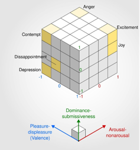
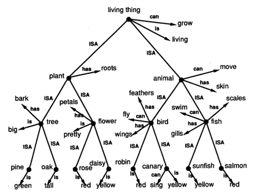
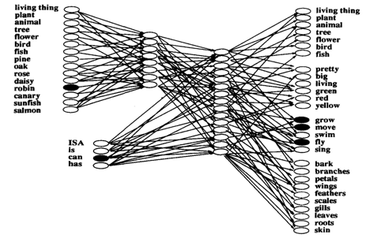
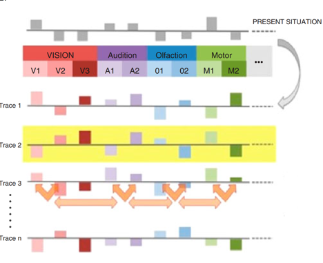

## Background

### What is a Memory Model?

At the most basic level computational models of memory will encode
information, store it, and then attempt to retrieve it. They are 
commonly applied to developing our understanding of how different 
kinds of learning and forgetting can occur in the brain. For this 
project we used the Multi Store Model (MSM) by Atkinson-Shiffrin 
as the inspiration for our design. We will briefly discuss the 
MSM, as well as two other memory model approaches (MINERVA 2 and 
connectionist models) that we could have used. 

### Multi Store Model (MSM)

In cases of severe epilepsy surgical removal of the epileptogenic 
focus may be indicated. Temporal lobe epilepsy represents 
approximately 2/3 of intractable seizure cases and throughout 
the 20th century it became clear that performing bilateral 
temporal lobectomies (as in the case of patient H.M.) resulted 
in profound impairments to the patient's declarative memory.[1] 
In the case of H.M. following the removal of most of his 
hippocampus he could shake your hand and carry on a conversation, 
but after you left the room and his thoughts drifted from your 
encounter he'd have no memory that you were ever there. It was 
this growing recognition of the role of different brain systems 
being involved in short term vs. long term memory that inspired 
Atkinson and Shiffrin's MSM (See Figure 1).[2]  

_Figure 1: An overview of Atkinson and Shiffrin's Multi Store Model_

The basis of the MSM is that the transition of information into memories 
is divided into 3 stages. Sensory Memory -> Short-Term Memory <-> 
Long Term Memory. 

#### Sensory Memory:

Theoretical models of “selective attention” had their heyday in the 
1960’s as the researchers Broadbent, Treisman, and Deutsch competed 
to get their names into introductory psych textbooks… The common theme 
amongst their models is that you’re not fully aware of everything 
around you, some of the information your senses register is forgotten 
before reaching other cognitive processes.[3] That there are limits to
our processing capacity is a theme that will appear again as we’re 
discussing the short-term memory stage. 

#### Short Term Memory: 

Following George Miller’s rather poetic reports of how the magical 
number seven was stalking and pursuing him throughout his work the 
concept of “short-term” memory became widely established.[4] If you’re
provided with a list of numbers or a list of random words, there’s a 
limit to the number of items you can hold in your cognitive buffer 
before new items will displace the old. As time goes by without 
rehearsal your memories of the list will begin to decay, and the 
items will become increasingly difficult to remember correctly. 
With sufficient rehearsal, e.g., repeating a list over and over, it is
possible to move memories into a more stable long-term storage from 
which they can later be retrieved.[5]

#### Long Term Memory:

The early work of Ebbinghaus demonstrates that while memories stored 
in the long term stage are more enduring than those held in the 
short-term stage the passage of time will make retrieval increasingly 
difficult.[6] The retention of information can also be disrupted by 
the presence of similar or competing information, this can occur 
proactively when previously acquired knowledge needs to be unlearned 
e.g., you have to change your password because the university got 
hacked…[7] Or it can occur retroactively when new information makes 
it difficult to remember existing details e.g., after using Emacs 
exclusively for 2 years you find you’ve forgotten the keyboard 
shortcuts in Microsoft word.[8] 

While the process of retrieval in the MSM model is typically 
represented with memories being encoded as discrete units. 
Modern theoretical understandings of “engrams” (i.e., units of 
cognitive information) suggest that memories are distributed 
throughout the brain with structures like the hippocampus acting 
as an indexing agent.[9] In practice this means that different 
aspects of memory like the logical semantic definition of a word 
(e.g., murder = unjustifiable homicide) and the affective dimensions
of that word (e.g., murder = bad) can be stored independently. 

Recall the temporal lesion patients that originally inspired the MSM.
With further investigation it became clear that their anterograde 
amnesia only affected certain memory domains. Patient H.M. for 
instance became increasingly proficient at drawing stars in a mirror
(a procedural memory task).[10] In another example Édouard Claparède 
was an early Swiss neurologist who is notorious for shaking the hand
of one of his patient’s while holding a concealed pin. 
Leaving and returning shortly thereafter he reports the patient had 
forgotten the episodic details of the handshake but was unwilling to 
shake Claparède’s hand a second time despite not having a clearly
articulable reason for their hesitancy (an example of behavioral 
conditioning).[11] The significance of these findings is that they 
demonstrate that there are different forms of long term memory 
that aren’t well represented as a single stage in the MSM.[12] 

### Emotion and Memory:

The emotional dimensions of valence and arousal have been 
demonstrated to engage distinct cognitive and neural processes 
contributing to enhanced memory.[13] Brown and Kulik’s work on 
“flashbulb memories” (i.e., memories of highly emotional episodic 
events like 9/11 or the Challenger disaster) reinforced earlier 
notions that emotional memories were indelible. Further research 
has demonstrated that the vivid detail often associated with 
memories for emotional events doesn’t mean that those memories 
are necessarily accurate. Even the memories for the emotions 
themselves can be subject to manipulation, in one example students 
asked to recall their emotional state before and after receiving an 
exam grade will tend to overestimate their feelings of anxiety after 
receiving a poor mark.[14] 

### Logic vs. Emotion:

Prior memory models have investigated how semantic relatedness along 
logical dimensions influences memory and learning.[15] 
We thought it would be interesting to instead explore how random 
drift along affective dimensions could impact memory over time. 
There is evidence that some material due to its affective dimensions 
is more likely to be stored and recalled when one is in a particular 
mood.[16] We wanted to explore the idea that when presented with a 
stimulus if we encode the affective dimensions of that stimulus, how 
effective a memory trace based on those emotional characteristics 
might be (in practice this turned out to not actually be very 
effective.. but we’ll discuss that more later on). The PAD (pleasure,
arousal, dominance) model developed by Russell and Mehrabian tries 
to characterize human emotional experiences along three dimensions 
(see Figure 2).[17] To encode stimuli with these dimensions we used 
Warriner’s database of lexical norms.[18]

_Figure 2: PAD (pleasure, arousal, dominance) model_

### Connectionist Models

While we drew upon the MSM as the inspiration for our memory model 
primarily due to its simplicity, there are other approaches that 
we could have taken. Connectionist models have several advantages:

 - They’re able to represent different features of memory in a  
   hierarchical structure in a way that explains how we’re able to 
   integrate common features of semantic knowledge (e.g., a rose is 
   a living thing, a flower and it’s pretty). Figure 3 provides a  
   good example of how information can be 
   hierarchically represented as a tree.
 - They’re able to represent that different types of long-term memory 
   can be distributed between systems like the hippocampus and the  
   neocortex such that the learning rate of higher order integrations
   of knowledge and understanding vs. the simple memorization of 
   lists can be represented by distinct systems with their own 
   learning rate. Figure 3 demonstrates how the same information from
   Figure 4 can be represented as a neural network.  

A limitation of connectionist models is that they’re prone to 
catastrophic forgetting when they attempt to emulate learning and 
memory on integrated learning tasks (e.g., tasks that require 
memorizing two interleaved lists of items).[15]

_Figure 3: A tree-like hierarchical representation of semantic knowledge that forms the basis of connectionist models._ 

_Figure 4: A neural network representation of semantic knowledge_
 

### Minerva 2
Developed by James Hintzman in the 1980’s, Minerva 2 represents 
memories as being distributed across a network of interconnected 
nodes. These nodes can include features from multiple systems, and 
collectively each set of features is called a “memory trace”. 
Whenever the system encounters a new stimulus a “probe” representing 
the features of the stimulus will run through the network activating 
memory traces. The sum of these activations can be thought of as an 
“echo”, and if the collective echo reaches a certain threshold the 
system will “recognize” the stimuli, if the echo does not reach the 
threshold, then it will not recognize the stimulus (Figure 5).[19]

_Figure 5: A representation of multiple memory traces in 
a Minerva model, in which a stimulus is being compared with 
existing memories on variety of perceptual dimensions._

### How we could improve our model:

Currently, our memory model examines drift along three affective 
dimensions using a binary search tree to index words by their 
emotional characteristics. As drift occurs the model recalls words 
with similar affective characteristics, but in practice these words 
don’t appear to be logically very similar. While our computational 
model may be “interesting”, in practice it is not a very good 
representation of how human memory works. The process of building 
the model has, however, provided us with insights on how going 
forward we could develop something more complex that better 
approximates biological memory. 

Recent work on human lexical development has found that the affective
dimensions of words are much less useful for predicting the 
development and evolution of language than other types of semantic 
knowledge like logical associations.[20] In their paper Brochhagen 
used the same lexical database from Warriner that we did to classify 
the affective characteristics of words, but being savvier than us 
they were able to integrate with several other existing databases 
of other kinds of semantic knowledge. Helpfully they’ve even included 
these databases in their open science framework repository, and if we
had more time, we’d make use of these… 

If we were to recreate our model again from scratch, the findings of 
Brochhagen suggest that our focus should really be on other semantic 
dimensions like the associativity of words. Drawing inspiration from 
these other models, instead of using binary search trees for three 
emotional dimensions we could use a multidimensional or kd-tree in 
which all the semantic properties of the words were represented in 
different dimensions.[21]

The nearest neighbors search algorithm for kd-trees operates 
similarly to a binary search tree with a few exceptions. The 
dimension you’re searching in rotates at each node. Eventually you 
arrive at a terminal node in multidimensional space that’s near the 
exact values you’re looking for, the search travels back and goes 
through other nodes to ensure that there aren’t any closer nodes, 
the algorithm terminates when the distance of all possible nearest 
neighbors have been examined.

One way to combine properties from the different models we’ve 
examined is here would be using a kd tree with a nearest neighbor’s 
search including all the semantic dimensions available in Brochhagen.
We could use training weights to determine a probabilistic frequency 
with which each dimension should be used at each node to 
“1. Give the right answer most of the time”, or 
“2. Give answers correctly and incorrectly in a manner approximating 
biological memory”.
