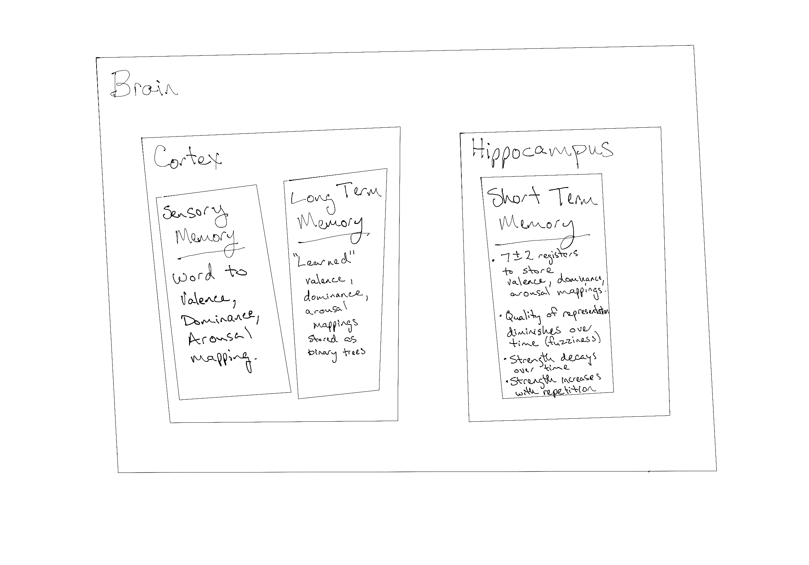

## Our Model

We have structured our model to vaguely match the brain structural regions 
with the conceptual functionality we have implemented. We did this, knowing 
that it was a gross over-simplification, as an attempt 
to evaluate the likelihood of the structures of the model being realistic for
the biological system. We feel that the model is not likely to be similarly implemented
in biological brains given the complications in communication at various points.

The core functionality of our model can be found in the model -> brain -> concepts folder. 
Each of the memory types is implemented within dedicated files (and classes). 

### Sensory Memory

The Sensory memory gets primed with a word list at the start of the simulation. 
This loads all "activation" patterns into data structures within SensoryMemory. 
For activation patterns, as mentioned above we have chosen to use the valence, dominance, 
and arousal mean scores mapped to words. As a way to simplify implementation we store this
as both a dictionary mapping and a series of binary search trees (within the [Factor](#Factor) class). 

### Short Term Memory

The majority of the functionality that we implemented is part of short term memory. 

The ShortTermMemory class has a list of [registers](#Memory Register), which has a varying capacity of 
7 plus or minus 2. We implemented this as a random variance. This could be improved by
having settings in the simulation to represent factors that influence short term memory 
capacity such as distraction level rather than being completely random.

As data is "sensed" it is pushed into the memory registers. In the simulation we 
randomly sense data in the cortex or explicitly through the "rehearse" function.

When an item enters short term memory it is assigned a baseline strength. This 
strength is increased if the item exists in long term memory already 
(i.e. through familiarity). It is also increased with repetition. The strength 
decreases as time passes. We have currently implemented this as a constant decrease
over time, but it should likely be reduced by an exponential decay factor instead.
If the strength threshold is reached the memory is pushed into long term memory.

As an item remains in short term memory its total age increases. In addition to 
total age, we keep track of age since last repetition (stored as "age"). For this 
value, we reset it any time we see a duplicate item enter memory. If the 
age (not total_age), of an item is greater than the maximum duration a memory 
can exist it will be removed from the registers. The maximum duration is a value 
between 15 and 30. Its value is also implemented as a random variance, and could be 
improved similarly to the maximum capacity value.

If the maximum capacity is reached items are removed from the registers. 
We implemented two possible simple strategies for 
removing these extra items. The default strategy is "oldest", where the item that 
has been in memory the longest, without recent repetition is removed. The second
strategy is "weakest". Using this strategy, the items with the lowest strength are 
removed. 

We implemented memory deterioration, which we refer to as fuzziness. We represented
deterioration by creating drift in the valence, dominance, and arousal values that are 
stored in the memory registers. As time passes, the values drift further from their 
original values. Thus making it more difficult to match the original word to the values 
in memory. We have a "Fuzzy Threshold" that can be manipulated in the simulation, which 
allows for non-exact matches when looking up values in either sensory or long term memory. 
A fuzzy comparison is also used when comparing values for possible repetition. 

#### Memory Register

The MemoryRegister stores the value of the memory along with its age 
(how long since it last entered memory in seconds), 
its total age (contiguous seconds since it first entered stm),
its strength, and the original value (before any drift). The original value 
was stored to make some implementation details of the simulation easier, but 
is not used as part of the model. 

### Long Term Memory

For Long Term memory we again store data in instances of our [Factor](#Factor) class.

As a possible future enhancement, we considered adding decay to the memories stored in long term memory. 
This would be at a much slower rate than the decay we implemented for short term memory. 

### Data Structures

#### Binary Search Tree

Holds a reference to the root node of the tree. All the hard work is done in the Node class.

#### Node

Stored in the binary search trees. Each node contains a value (ex. the valence mean score), a 
list of data (ex. the word), and references to its child nodes - left and right.

#### Factor

Factors each store a binary search tree along with a weight. We create one Factor object
for each of the factors we are using in our representation of words 
(valence, dominance, arousal). 

We had a stretch goal to implement
a learning algorithm for long term memory which could utilize the weight. 
The weight would be used to indicate which of the factors (valence, dominance, arousal) 
would be more influential when looking up values in long term memory. This was not implemented.

## Potential Larger-Scale Model Improvements

Currently, our memory model examines drift along three affective 
dimensions using a binary search tree to index words by their 
emotional characteristics. As drift occurs the model recalls words 
with similar affective characteristics, but in practice these words 
don’t appear to be logically very similar. While our computational 
model may be “interesting”, in practice it is not a very good 
representation of how human memory works. The process of building 
the model has, however, provided us with insights on how going 
forward we could develop something more complex that better 
approximates biological memory. 

Recent work on human lexical development has found that the affective
dimensions of words are much less useful for predicting the 
development and evolution of language than other types of semantic 
knowledge like logical associations [(Brochhagen et al., 2023)](#brochhagen-et-al-2023). 
In their paper Brochhagen 
used the same lexical database from Warriner that we did to classify 
the affective characteristics of words, but being savvier than us 
they were able to integrate with several other existing databases 
of other kinds of semantic knowledge. Helpfully they’ve even included 
these databases in their open science framework repository, and if we
had more time, we’d make use of these… 

If we were to recreate our model again from scratch, the findings of 
Brochhagen suggest that our focus should really be on other semantic 
dimensions like the associativity of words. Drawing inspiration from 
these other models, instead of using binary search trees for three 
emotional dimensions we could use a multidimensional or kd-tree in 
which all the semantic properties of the words were represented in 
different dimensions [(Ram & Sinha, 2019)](#ram-sinha-2019).

The nearest neighbors search algorithm for kd-trees operates 
similarly to a binary search tree with a few exceptions. The 
dimension you’re searching in rotates at each node. Eventually you 
arrive at a terminal node in multidimensional space that’s near the 
exact values you’re looking for, the search travels back and goes 
through other nodes to ensure that there aren’t any closer nodes, 
the algorithm terminates when the distance of all possible nearest 
neighbors have been examined.

One way to combine properties from the different models we’ve 
examined is here would be using a kd tree with a nearest neighbor’s 
search including all the semantic dimensions available in Brochhagen.
We could use training weights to determine a probabilistic frequency 
with which each dimension should be used at each node to 
“1. Give the right answer most of the time”, or 
“2. Give answers correctly and incorrectly in a manner approximating 
biological memory”.
